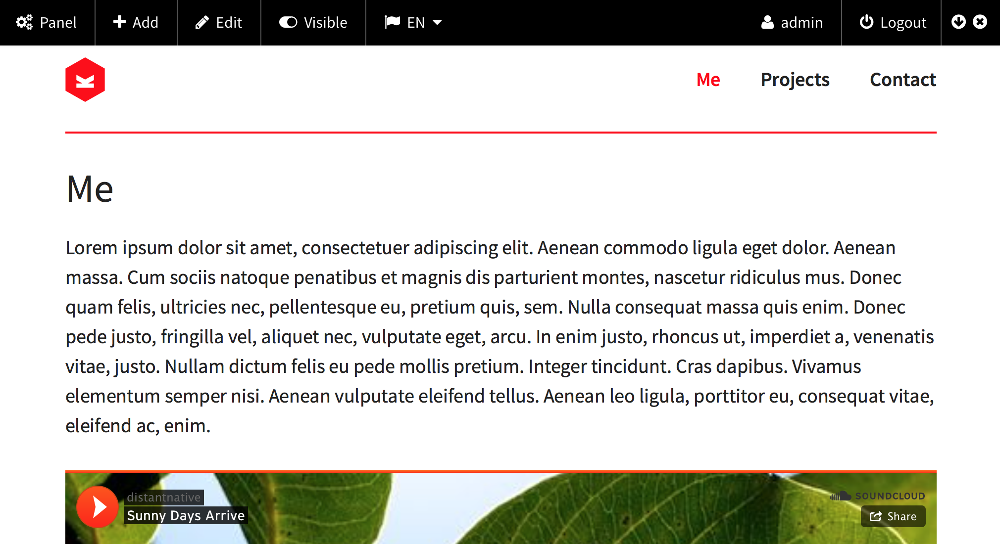

  

[](https://github.com/distantnative/panel-bar/releases)  [](https://github.com/distantnative/panel-bar/issues) [](https://raw.githubusercontent.com/distantnative/panel-bar/master/LICENSE)
[](https://gumroad.com/l/kirby-panelbar)


This plugin enables you to include a panel bar on top of your site which gives you direct access to some administrative functions. The panel bar will only be visible to logged in users who are eligible to access the panel.



**The plugin is free. However, I would really appreciate if you could support me with a [moral license](https://gumroad.com/l/kirby-panelbar)!**


# Table of Contents
1. [Installation & Update](#Installation)
2. [Usage](#Usage)
3. [Options](#Options)
4. [Help & Improve](#Help)
5. [Version History](#VersionHistory)


# Installation & Update <a id="Installation"></a>
1. Download [Panel Bar](https://github.com/distantnative/panel-bar/zipball/master/)
2. Copy the whole folder to `site/plugins/panel-bar`


# Usage <a id="Usage"></a>
Include in your `site/snippets/footer.php` right before the `</body>` tag:
```php
<?php echo panelbar::show(); ?>
```

Or with the following if you want the panel bar hidden on load:
```php
<?php echo panelbar::hide(); ?>
```

You can toggle the visibility of the panel bar on the right side, but only if your website already loads jQuery. If not, panel bar will simply hide the toggle switch and display the panel bar always.

# Options <a id="Options"></a>

## Output CSS / JS separately
If you want to output the CSS and/or JS not with the panel bar, but separately e.g. in the `<head>` section, you first have to use (first parameter is `true` to get all default elements):

```php
<?php echo panelbar::show($elements = true, $css = false, $js = false); ?>
```

Then you can add the following code where you want to output the CSS/JS:

```php
<?php echo panelbar::css(); ?>
<?php echo panelbar::js(); ?>
```


## Enhanced JS
If you have jQuery already loaded, Panel Bar can do some enhanced features through javascript. For them you have to set the following config:

```
c::set('panelbar.enhancedJS', true);
```

So far, this enables you to toggle pages' visibility right from the panel bar without being redirected to the panel.


## Custom elements

Panel Bar is ready to include custom elements. Those should be set as config option:

```php
c::set('panelbar.elements', array());
```

This option overrides all default elements. You can either include them by naming them:

```php
c::set('panelbar.elements', array(
  'panel', 
  'edit', 
  'toggle', 
  'languages', 
  'logout', 
  'user'
));
```

Or you can merge the custom array with all default elements:

```php
c::set('panelbar.elements', a::merge(array(
  'custom1',
  'custom 2'
), panelbar::defaults()));
```

You can also pass an array with all elements as first parameter when calling `panelbar::show()`.

For custom elements you can either pass the HTML directly in the array or use the name of a callable function in the array which then returns the HTML code.

Moreover, there are currently two helpers available to create elements:

**Link elements**
```php
panelbar::link(array(
  'id'     => 'panel',
  'icon'   => 'cogs',
  'url'    => site()->url().'/panel',
  'label'  => 'Panel'
  'mobile' => 'icon',
));
```

**Dropdown elements**
```php
panelbar::dropdown(array(
  'id'    => 'lang',
  'icon'  => 'flag',
  'label' => 'Language',
  'items' => array(
               0 => array(
                     'url'   => …,
                     'label' => …
                    ),
               1 => array(
                     'url'   => …,
                     'label' => …
                    ),
               …
             ),
  'mobile' => 'label',
));
```

**Example**
```php
c::set('panelbar.elements', array(
  'panel', 
  'edit',
  'custom-link' => panelbar::link(array(
                    'id'   => 'mum',
                    'icon' => 'heart',
                    'url'  => 'http://mydomain.com/pictureofmum.jpg',
                    'text' => 'Mum'
                  )),
  'custom-dropdown' => 'dropitpanelbar',
  'logout', 
));

function dropitpanelbar() {
  return panelbar::dropdown(array(
    'id'    => 'songs',
    'icon'  => 'headphones',
    'label' => 'Songs',
    'items' => array(
                 0 => array(
                       'url' => 'https://www.youtube.com/watch?v=BIp_Y28qyZc',
                       'text' => 'Como Soy'
                      ),
                 1 => array(
                       'url' => 'https://www.youtube.com/watch?v=gdby5w5rseo',
                       'text' => 'Me Gusta'
                      ),
               )
  ));
}
```
*Be aware of the [current problem](https://github.com/distantnative/panel-bar/issues/4) with `config.php`.*

You cannot use any of the following as name/id of your custom elements:  
`show, hide, css, js, defaults, __construct, __output, __content, __controlBtn, __switchBtn, __flipBtn, __float, __getCSS, __getJS, link, dropdown`


## Position of Panel Bar
You can switch the position of the panel bar from the top to the bottom browser window border (in your `site/config/config.php`):

```php
c::set('panelbar.position', 'bottom');
```


# Help & Improve <a id="Help"></a>
*If you have any suggestions for new elements or further configuration options, [please let me know](https://github.com/distantnative/panel-bar/issues/new).*


# Version history <a id="VersionHistory"></a>
Check out the more or less complete [changelog](https://github.com/distantnative/panel-bar/blob/master/CHANGELOG.md).
